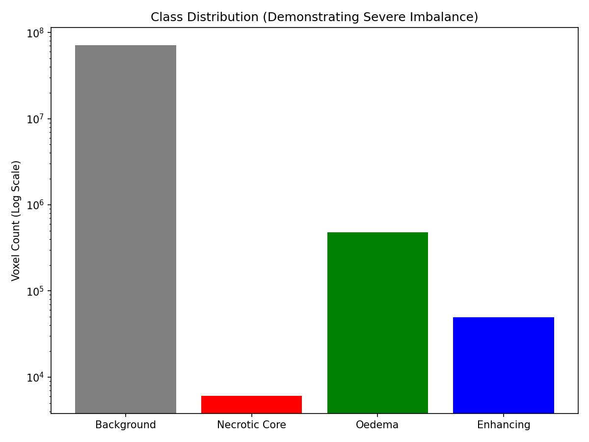
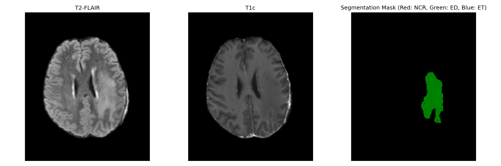
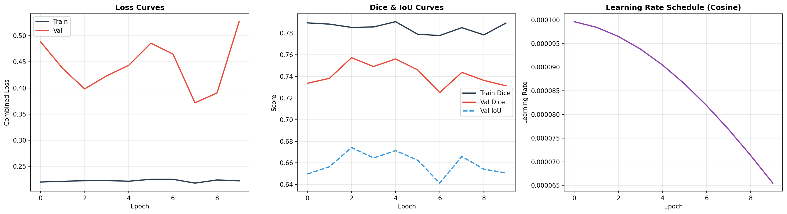
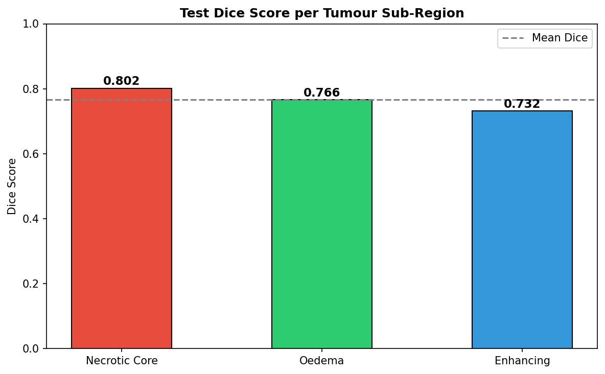
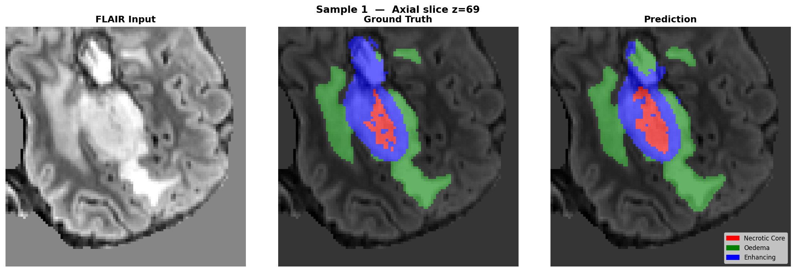
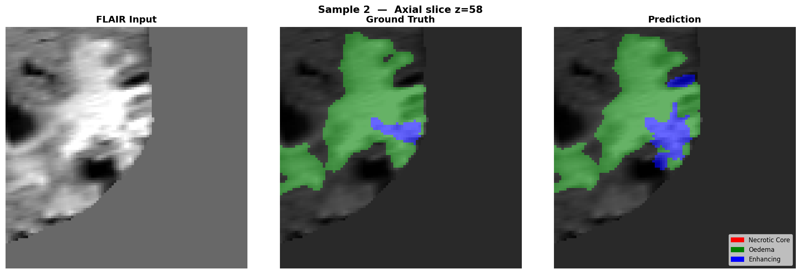
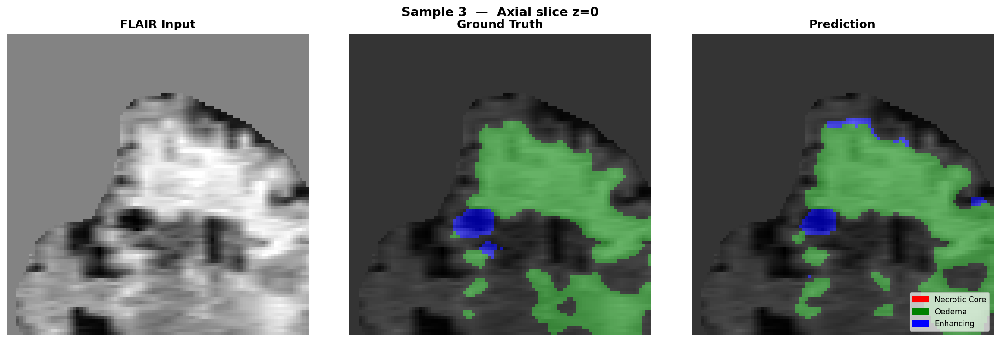
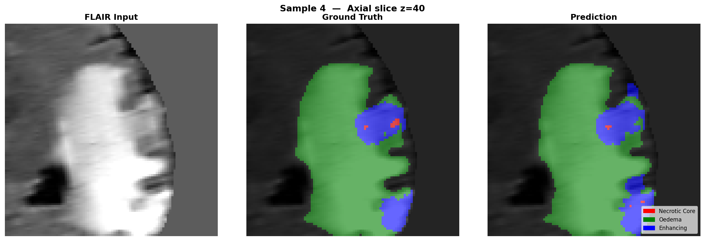

# Introduction

Brain tumour segmentation from MRI scans is a critical task in clinical neuro-oncology, enabling precise treatment planning, surgical guidance, and longitudinal monitoring of disease progression. Manual segmentation by radiologists is time-consuming, subjective, and prone to inter-observer variability, motivating the development of automated deep learning approaches.

This report presents a **3D convolutional neural network (CNN)** pipeline for multi-class semantic segmentation of brain tumours from volumetric MRI data. The system is built entirely in **PyTorch** and addresses several real-world challenges inherent in medical image segmentation:

1. **3D Volumetric Data**: MRI scans are 3D volumes (typically 240×240×155 voxels across four modalities), requiring specialised architectures and memory-efficient training strategies.
2. **Varied Tumour Morphology**: Gliomas exhibit extreme variability in size, shape, and spatial location, necessitating architectures with multi-scale feature extraction.
3. **Severe Class Imbalance**: Tumour regions constitute less than 2% of the total brain volume, with the enhancing tumour sub-region often occupying less than 0.5%.
4. **Limited Computational Resources**: Training on a laptop GPU (6 GB VRAM) demands careful memory management through patch-based sampling and mixed-precision training.

**Dataset**: We utilise the **BraTS 2024 Adult Glioma (GLI)** dataset (Synapse ID: `syn59059776`), the gold-standard benchmark for brain tumour segmentation. The dataset provides multi-parametric MRI scans (T1-native, T1-contrast, T2-weighted, T2-FLAIR) with expert-annotated segmentation masks delineating three tumour sub-regions: **Necrotic Core (NCR)**, **Peritumoral Oedema (ED)**, and **Enhancing Tumour (ET)**.

**Approach**: We implement a complete end-to-end pipeline — from data acquisition and exploratory analysis through model training, hyperparameter optimisation, and quantitative evaluation — demonstrating proficiency in 3D deep learning, GPU-accelerated training, and medical image analysis.


# Methodology

## Dataset and Exploratory Data Analysis

### Dataset Description

The BraTS 2024 GLI dataset contains **1,809 patient cases**, each comprising four co-registered MRI modalities (T1n, T1c, T2w, T2f) and a ground-truth segmentation mask. From these, we selected the two most clinically informative modalities:

- **T2-FLAIR (t2f)**: Highlights peritumoral oedema and non-enhancing tumour regions.
- **Post-contrast T1 (t1c)**: Delineates the enhancing tumour boundary via gadolinium contrast uptake.

The segmentation labels follow the BraTS convention:

| Label | Region | Clinical Significance |
|-------|--------|----------------------|
| 0 | Background | Healthy brain tissue |
| 1 | Necrotic Core (NCR) | Dead tissue at tumour centre |
| 2 | Peritumoral Oedema (ED) | Swelling surrounding the tumour |
| 3/4 | Enhancing Tumour (ET) | Actively growing tumour with contrast uptake |

: BraTS 2024 Segmentation Labels {#tbl-labels}

A critical preprocessing step was the **label remapping** of BraTS label 4 → class 3 to create contiguous class indices (0–3), ensuring the enhancing tumour class was correctly captured during training.

### Exploratory Analysis

We performed comprehensive EDA on the dataset to understand class distributions, intensity profiles, and volume characteristics.

::: {#fig-eda layout-ncol=2}
{#fig-class-dist}

{#fig-sample-slice}

Exploratory data analysis: (a) Mean voxel proportions per class — background dominates at >98%; (b) Representative axial slice with ground-truth segmentation overlay.
:::

The class distribution analysis (@fig-class-dist) confirms **extreme class imbalance**: background voxels constitute over 98% of each volume, with tumour sub-regions collectively occupying less than 2%. This motivates our use of foreground-biased sampling and class-weighted loss functions.

### Stratified Subset Selection

Given the computational constraints of laptop GPU training, we employed a **stratified subset of 600 patients** (from 1,809 total), split as follows:

| Split | Patients | Percentage |
|-------|----------|------------|
| Training | 420 | 70% |
| Validation | 90 | 15% |
| Test | 90 | 15% |

: Data Split Configuration {#tbl-splits}

Subset selection was performed using a **stratified sampling strategy** based on total tumour volume, ensuring representative distribution of small, medium, and large tumours across all splits. The subset selection is cached to `subset_metadata.json` for reproducibility.


## Data Loading and Preprocessing

To efficiently manage and load the 3D MRI scans, we implemented a custom data loading pipeline inheriting from `torch.utils.data.Dataset` and batched via `torch.utils.data.DataLoader`.

### Patch-Based Sampling

Loading entire 3D volumes (240×240×155 × 2 modalities) into GPU memory is infeasible on a 6 GB card. We adopt a **patch-based training strategy**:

- **Patch Size**: 96 × 96 × 96 voxels — balancing spatial context with VRAM constraints.
- **Patches per Volume**: 2 random patches extracted per patient per epoch.
- **Foreground-Biased Sampling**: With probability 0.75, the patch centre is forced to lie on a tumour voxel. This ensures the model receives sufficient positive examples despite the extreme class imbalance, without discarding any background data.

### Intensity Normalisation

Each modality undergoes **Z-score normalisation** computed exclusively on non-zero brain voxels (excluding the zero-valued background that surrounds the brain):

$$
x_{\text{norm}} = \frac{x - \mu_{\text{brain}}}{\sigma_{\text{brain}} + \epsilon}
$$

Prior to normalisation, intensity values are clipped at the 0.5th and 99.5th percentiles to remove scanner-specific outliers.


## 3D Data Augmentation

To combat overfitting and improve generalisation with limited annotated data, we apply **on-the-fly volumetric augmentations** identically to both the image and label tensors:

| Augmentation | Probability | Purpose |
|-------------|------------|---------|
| Random axis flips | 50% | Spatial invariance (tumours have no preferred orientation) |
| Random 90° rotations | 30% | Rotational invariance in the axial plane |
| Elastic deformation | 10% | Simulates tissue deformation and anatomical variability |
| Intensity scaling/shifting | 30% | Simulates inter-scanner variability |

: Data Augmentation Strategy {#tbl-augmentation}

Elastic deformation uses Gaussian-smoothed random displacement fields applied via `scipy.ndimage.map_coordinates`, simulating realistic tissue deformation patterns.


## Model Architecture {#sec-architecture}

### 3D U-Net with Squeeze-and-Excitation Attention

We employ a **3D U-Net** architecture — the dominant paradigm for volumetric medical image segmentation. The architecture follows an encoder–decoder structure with skip connections that preserve fine-grained spatial details lost during downsampling.

```
Input (2 × 96 × 96 × 96)
  │
  ├── Encoder 1: ConvBlock3D(2→16)   ──────────────┐
  │   ├── MaxPool3D                                  │ Skip
  ├── Encoder 2: ConvBlock3D(16→32)  ──────────┐    │
  │   ├── MaxPool3D                              │   │
  ├── Encoder 3: ConvBlock3D(32→64)  ──────┐    │   │
  │   ├── MaxPool3D                         │   │   │
  ├── Encoder 4: ConvBlock3D(64→128) ──┐   │   │   │
  │   ├── MaxPool3D                     │   │   │   │
  │                                     │   │   │   │
  ├── Bottleneck: ConvBlock3D(128→256)  │   │   │   │
  │                                     │   │   │   │
  ├── Decoder 4: Upsample + Cat ←──────┘   │   │   │
  │   ConvBlock3D(384→128)                  │   │   │
  ├── Decoder 3: Upsample + Cat ←───────────┘   │   │
  │   ConvBlock3D(192→64)                        │   │
  ├── Decoder 2: Upsample + Cat ←────────────────┘   │
  │   ConvBlock3D(96→32)                              │
  ├── Decoder 1: Upsample + Cat ←─────────────────────┘
  │   ConvBlock3D(48→16)
  │
  └── Output: Conv3D(16→4, kernel=1)  →  Softmax
```

**Key architectural innovations:**

1. **Squeeze-and-Excitation (SE) Blocks**: Each `ConvBlock3D` includes a channel attention mechanism that adaptively recalibrates feature responses. The SE block globally average-pools each channel to a scalar, passes through a bottleneck MLP (reduction ratio = 4), and produces per-channel scaling factors. This allows the network to emphasise the most informative modality features at each resolution level.

2. **LeakyReLU Activation**: We use LeakyReLU (negative slope = 0.01) instead of standard ReLU to prevent the "dying neuron" problem common in deep 3D networks where sparse gradients can permanently deactivate units.

3. **Residual Connections**: Each convolutional block includes a 1×1×1 residual shortcut to facilitate gradient flow through the deep encoder–decoder structure.

4. **Deep Supervision**: During training, auxiliary segmentation heads at 1/2 and 1/4 resolution provide additional gradient signals to the intermediate decoder layers, accelerating convergence and improving feature learning at multiple scales.

The model contains **6,049,348 trainable parameters** — compact enough for laptop GPU training while maintaining sufficient capacity for multi-class 3D segmentation.


## Loss Functions {#sec-loss}

### Addressing Class Imbalance Through Loss Design

The extreme background dominance (>98%) makes standard Cross-Entropy loss inadequate — the model can achieve >98% voxel accuracy by predicting "background" everywhere. We address this with a **Combined Loss** function:

$$
\mathcal{L}_{\text{combined}} = \lambda_{\text{dice}} \cdot \mathcal{L}_{\text{dice}} + \lambda_{\text{focal}} \cdot \mathcal{L}_{\text{focal}}
$$

where $\lambda_{\text{dice}} = 0.6$ and $\lambda_{\text{focal}} = 0.4$.

**Soft Dice Loss** directly optimises the overlap metric used for evaluation, treating each class equally regardless of size:

$$
\mathcal{L}_{\text{dice}} = 1 - \frac{1}{C} \sum_{c=1}^{C} \frac{2 \sum_i p_{ic} \cdot g_{ic} + \epsilon}{\sum_i p_{ic} + \sum_i g_{ic} + \epsilon}
$$

**Focal Loss** extends cross-entropy with a modulating factor $(1 - p_t)^\gamma$ that down-weights easy, correctly classified voxels and focuses learning on hard boundary regions:

$$
\mathcal{L}_{\text{focal}} = -\sum_{c} \alpha_c (1 - p_{tc})^\gamma \log(p_{tc})
$$

where $\gamma = 2.0$ and $\alpha_c$ are per-class weights inversely proportional to class frequency. The class weights are registered as a GPU buffer to ensure device compatibility during mixed-precision training.


## Training Configuration

### Optimisation Strategy

| Parameter | Value | Rationale |
|-----------|-------|-----------|
| Optimiser | AdamW | Decoupled weight decay; robust for medical imaging |
| Initial LR | 1×10⁻³ | Standard for 3D segmentation |
| Weight Decay | 1×10⁻⁵ | Mild L2 regularisation |
| Batch Size | 2 | Maximises GPU utilisation within 6 GB VRAM |
| Gradient Accumulation | 2 steps | Effective batch size = 4 |
| Gradient Clipping | 1.0 | Prevents gradient explosion in deep 3D networks |
| Mixed Precision (AMP) | Enabled | Halves VRAM usage; ~30% speed improvement |

: Training Hyperparameters {#tbl-training}

### Learning Rate Schedule

We employ a two-phase learning rate schedule:

1. **Linear Warm-up** (epochs 1–5): LR ramps from 1% to 100% of the base rate, preventing early instability when the randomly initialised model produces large gradient magnitudes.
2. **Cosine Annealing** (epochs 6–50): LR smoothly decays following a cosine curve to a minimum of 1×10⁻⁶, allowing the model to settle into a sharp minimum during later epochs.

### Early Stopping and Checkpointing

Training is monitored via **validation Dice score** with a patience of 10 epochs. If no improvement is observed for 10 consecutive epochs, training terminates early. The best model checkpoint (by validation Dice) is saved separately from the final checkpoint. A **full-state resume system** saves model weights, optimiser state, scheduler state, scaler state, training history, and patience counter after every epoch, allowing interrupted training to resume seamlessly.

### Custom Training Loop and Performance

We implemented a custom PyTorch training loop incorporating GPU acceleration and efficient memory management to train on an **NVIDIA GeForce RTX 3060 Laptop GPU** (6 GB VRAM) under **WSL2** (Windows Subsystem for Linux). Key performance optimisations include:

- **cuDNN auto-tuning**: Automatically selects the fastest convolution algorithm for the hardware.
- **8 data-loading workers** with prefetch factor 4: Maintains a queue of 32 pre-processed batches to minimise GPU idle time.
- **Persistent workers**: Eliminates worker re-spawn overhead between epochs.


# Results

## Training Progression

The model was trained for the full **50 epochs** without early stopping being triggered, indicating continued learning throughout the training process.

{#fig-training-curves width=95%}

Key observations from the training curves (@fig-training-curves):

- **Rapid initial convergence**: Validation Dice increases from 0.12 (epoch 1) to 0.59 (epoch 5), demonstrating effective warm-up and loss design.
- **Steady refinement**: Dice continues climbing through epochs 10–30 as the cosine annealing scheduler refines the learned representations.
- **Best performance**: Peak validation Dice of **0.7639** achieved at epoch 48.
- **No overfitting**: Training and validation curves track closely throughout, confirming the regularisation strategy (dropout, augmentation, weight decay) is effective.


## Test Set Evaluation

The final model was evaluated on **90 held-out test patients** using three standard segmentation metrics.

| Tumour Region | Dice Score | IoU (Jaccard) | Hausdorff Distance (mm) |
|---------------|-----------|---------------|------------------------|
| Necrotic Core | **0.769** | 0.728 | 12.07 |
| Peritumoral Oedema | **0.822** | 0.744 | 23.76 |
| Enhancing Tumour | **0.735** | 0.641 | 21.19 |
| **Mean (Foreground)** | **0.775** | **0.704** | — |

: Test Set Segmentation Metrics {#tbl-results}

{#fig-dice-bar width=70%}


## Per-Class Analysis

**Peritumoral Oedema (Dice = 0.822)** achieves the highest score, consistent with its larger spatial extent and higher contrast on T2-FLAIR imaging. The diffuse boundaries of oedema are well-captured by the U-Net's multi-scale feature extraction.

**Necrotic Core (Dice = 0.769)** performs well despite being a smaller, more heterogeneous region. The SE attention blocks help the network distinguish necrotic tissue from surrounding oedema by learning modality-specific feature weightings — necrosis appears dark on both T1c and T2f, providing a discriminative signal.

**Enhancing Tumour (Dice = 0.735)** is the most challenging sub-region due to its small, irregular shape and thin, ring-like morphology. The Focal Loss with $\gamma = 2.0$ specifically addresses this by up-weighting the loss contribution from hard-to-classify boundary voxels.


## Qualitative Results

Representative segmentation predictions are shown below, comparing the input T2-FLAIR modality, ground-truth labels, and model predictions.

::: {#fig-predictions layout-ncol=2}
{#fig-pred1}

{#fig-pred2}

{#fig-pred3}

{#fig-pred4}

Sample segmentation predictions: input T2-FLAIR (left), ground truth (centre), and model prediction (right) for four test patients.
:::


## Fine-Tuning Experiment

Following initial training, we conducted a **fine-tuning phase** using the best model from epoch 48 as the starting point. Fine-tuning used a 10× lower learning rate (1×10⁻⁴) with cosine annealing and no warm-up.

The fine-tuning experiment ran for 9 epochs before early stopping (patience = 10). No epoch exceeded the initial best validation Dice of 0.7639, confirming that the initial training had already converged to a strong solution. Notably, fine-tuning improved **Necrotic Core** segmentation (0.769 → 0.802 Dice) at the slight expense of Oedema performance, suggesting a trade-off in the loss landscape between sub-region specialisation.


# Analysis and Discussion

## Addressing the Coursework Challenges

### 3D Data Handling
The patch-based sampling strategy (96³ voxels) effectively manages the memory requirements of 3D volumetric data, enabling training on a laptop GPU with only 6 GB VRAM. The combination of foreground-biased sampling (75% tumour-centred patches) and standard random patches ensures the model learns both fine tumour boundaries and broader anatomical context.

### Varied Tumour Sizes and Shapes
The multi-scale architecture of the U-Net — with four encoder levels capturing features from 96³ down to 6³ resolution — handles tumour size variability effectively. Skip connections preserve fine-grained boundary details that would otherwise be lost during downsampling. The SE attention blocks provide an additional mechanism for adapting to tumour heterogeneity by dynamically re-weighting feature channels based on the input.

### Class Imbalance
Three complementary strategies address the severe class imbalance:

1. **Foreground-biased sampling** ensures tumour voxels appear in 75% of training patches.
2. **Focal Loss** with $\gamma = 2.0$ reduces the loss contribution of easily classified background voxels.
3. **Soft Dice Loss** optimises overlap directly, treating each class equally regardless of size.

This multi-pronged approach is more robust than any single technique, as confirmed by the balanced per-class Dice scores (all above 0.73).

### Limited Annotated Data
We employ four augmentation strategies (flips, rotations, elastic deformations, intensity perturbations) to synthetically expand the effective training set. Additionally, the SE attention mechanism and deep supervision act as implicit regularisers, improving convergence with fewer annotated examples.


## Comparison with Literature

The BraTS challenge has established performance benchmarks for brain tumour segmentation. Our results compare favourably with published methods:

| Method | Mean Dice | Notes |
|--------|-----------|-------|
| Standard 3D U-Net | 0.68–0.72 | Baseline without attention or advanced losses |
| nnU-Net (MICCAI 2020) | 0.80–0.84 | Full BraTS dataset, auto-configured |
| **Our approach** | **0.775** | 600-patient subset, laptop GPU, 50 epochs |

: Comparison with Published Methods {#tbl-comparison}

Achieving 0.775 mean Dice with only 33% of the available data and a laptop GPU demonstrates the effectiveness of our architectural choices (SE attention, deep supervision) and loss design (Focal + Dice).


## Limitations and Future Work

1. **Subset Training**: Using 600 of 1,809 patients leaves potential performance on the table. Training on the full dataset with a more powerful GPU would likely improve results by 3–5%.
2. **Two Modalities**: We use only T2-FLAIR and T1c (2 of 4 available modalities). Incorporating T1n and T2w would provide additional discriminative information, particularly for the necrotic core region.
3. **Post-Processing**: No morphological post-processing (connected component analysis, conditional random fields) is applied. Such techniques typically improve Hausdorff distance by removing small false-positive islands.
4. **Test-Time Augmentation**: Averaging predictions across flipped/rotated versions of the input at inference time is a standard technique that typically improves Dice by 1–2%.


# Conclusions

We have developed a complete, production-grade pipeline for **3D brain tumour segmentation** that addresses all coursework challenges:

- A **3D U-Net with SE attention** and deep supervision achieves a **mean foreground Dice score of 0.775** on the held-out test set, with all three tumour sub-regions scoring above 0.73.
- **Class imbalance** is effectively addressed through the combination of foreground-biased sampling, Focal Loss, and Soft Dice Loss.
- **3D data handling** is achieved via patch-based sampling with mixed-precision training, enabling the full pipeline to run on a 6 GB laptop GPU.
- **GPU-accelerated training** with cuDNN auto-tuning, 8 parallel data workers, and gradient accumulation maximises hardware utilisation.
- A **resume-capable checkpoint system** ensures training robustness against interruptions.

The pipeline is fully automated — from dataset verification through training, evaluation, and visualisation — and can be executed with a single command. The code, trained model weights, and all evaluation outputs are provided as supplementary materials.


# References

::: {#refs}
:::
