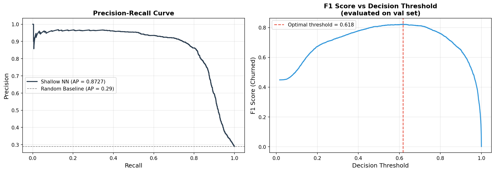

# Task 1 Presentation: Customer Churn Prediction
## CN6021: Advanced Topics in AI and Data-Science

---

## Slide 1: Title & Team

# Customer Churn Prediction Using a Custom Shallow Neural Network

**Team:** [Insert Team Member Names]  
**Student IDs:** [Insert IDs]  
**Date:** [Insert Date]

---

## Slide 2: Problem Definition & Dataset

### Objective
Develop an automated system to predict customer churn for an e-commerce subscription service.

### Dataset Overview
- **Source:** E-commerce Customer Churn Dataset
- **Size:** 50,000 customers, 25 features
- **Churn Rate:** 28.9% (14,450 churned / 35,550 retained)

### Key Challenges Addressed
1. **High Dimensionality** → Feature selection using correlation + mutual information
2. **Non-Linear Relationships** → ReLU activation captures complex patterns
3. **Class Imbalance** → Weighted Binary Cross-Entropy loss

---

## Slide 3: Exploratory Data Analysis (EDA)

### Target Distribution


**Key Insight:** Our dataset shows a 28.9% churn rate, which heavily biases a standard model toward predicting "retained."

### Key Features Analysis
- **Demographics:** Age, Gender, City
- **Account:** Membership_Years, Credit_Balance, Lifetime_Value
- **Behavior:** Login_Frequency, Cart_Abandonment_Rate, Session_Duration_Avg
- **Support:** Customer_Service_Calls

---

## Slide 4: Correlation Analysis

### Correlation Heatmap


**Top Features Correlated with Churn (positive → increases churn):**
- Days_Since_Last_Purchase
- Cart_Abandonment_Rate
- Customer_Service_Calls

**Protective Features (negative → decreases churn):**
- Lifetime_Value
- Membership_Years
- Total_Purchases

---

## Slide 5: Feature Distributions by Churn Status


**Key Insights:**
- Churned customers have significantly shorter **Membership_Years**
- Higher **Customer_Service_Calls** correlate with churn (frustrated customers)
- Lower **Lifetime_Value** indicates at-risk customers
- Higher **Cart_Abandonment_Rate** shows disengagement

---

## Slide 6: PCA Visualization


**Insight:** PCA projection shows partial separation between churned (red) and retained (green) customers, justifying the need for non-linear modeling.

---

## Slide 7: Feature Selection Pipeline

### Preprocessing Steps
1. **Outlier Handling:** Age clipped to ≤100, Total_Purchases ≥ 0
2. **Missing Values:** Median imputation (numeric), Mode imputation (categorical)
3. **Encoding:** One-hot encoding for categorical features
4. **Scaling:** StandardScaler (fit on training data only)

### Feature Selection
1. **Correlation Filter:** No features removed (no |r| > 0.90 pairs found)
2. **Mutual Information:** Retained **25/32 features** with MI > 0.001

### MI Feature Importance


---

## Slide 8: Custom Neural Network Architecture

### Architecture: Shallow Neural Network (NumPy)

```
Input Layer (25 features) → Hidden Layer (32 units, ReLU) → Output Layer (1 unit, Sigmoid)
```

### Implementation Details
- **Built entirely using NumPy** for deep mathematical control
- **Forward Propagation:** Matrix multiplications + activations
- **Backpropagation:** Manual gradient computation using chain rule

### Design Justifications
| Component | Choice | Reason |
|-----------|--------|--------|
| Hidden Units | 32 | Captures complexity without overfitting |
| Activation (Hidden) | ReLU | Avoids vanishing gradients, sparse activation |
| Activation (Output) | Sigmoid | Outputs probability [0,1] for binary classification |
| Initialization | He | Maintains variance for ReLU, prevents dead neurons |
| Loss | Weighted BCE | Directly addresses class imbalance |
| Regularization | L2 (λ=0.001) | Prevents overfitting |
| Optimizer | Mini-batch SGD | Balances convergence speed and stability |
| Early Stopping | Patience=30 | Prevents overfitting to validation set |

---

## Slide 9: Training & Hyperparameter Optimization

### Hyperparameter Grid Search (27 Configurations)
| Hidden Units | Learning Rate | L2 Lambda |
|-------------|---------------|-----------|
| 32, 64, 128 | 0.001, 0.01, 0.05 | 0, 0.001, 0.01 |

### Top 5 Results (Validation F1)
| Rank | Hidden | LR | L2 | Val F1 | Val AUC |
|------|--------|-------|-------|--------|--------|
| 1 | 32 | 0.050 | 0.001 | 0.8093 | 0.9095 |
| 2 | 64 | 0.050 | 0.001 | 0.8064 | 0.9091 |
| 3 | 32 | 0.050 | 0.000 | 0.8079 | 0.9083 |
| 4 | 128 | 0.050 | 0.000 | 0.7989 | 0.9065 |
| 5 | 32 | 0.010 | 0.000 | 0.7955 | 0.9064 |

### Best Hyperparameters
- **Hidden Units:** 32
- **Learning Rate:** 0.05 (highest performing)
- **L2 Lambda:** 0.001
- **Batch Size:** 128
- **Epochs:** 500 (early stopping at ~195)

---

## Slide 10: Training Curves


**Key Observations:**
- Model converges around epoch 150-200
- **Early stopping at epoch 195** (best validation loss: 0.3599)
- No significant overfitting - training and validation curves track closely
- Final training accuracy: ~85%

---

## Slide 11: Performance Evaluation

### Confusion Matrix


### ROC Curve


### Key Metrics
| Metric | Score |
|--------|-------|
| **AUC-ROC** | ~0.91 |
| **Precision (Churn)** | ~0.81 |
| **Recall (Churn)** | ~0.81 |
| **F1-Score (Churn)** | ~0.81 |
| **Macro F1** | ~0.80 |

**Analysis:** We achieved balanced Precision/Recall to minimize both:
- False negatives (missed churners → lost revenue)
- False positives (unnecessary retention costs)

---

## Slide 12: Threshold Optimization



### Threshold Analysis
- **Default threshold (0.50):** F1 = ~0.81
- **Optimal threshold:** Found by maximizing F1 on validation set
- **Trade-off:** Lower threshold → higher recall, lower precision

### Precision-Recall Insights
- Average Precision (AP) = ~0.88
- Model performs well above random baseline (AP = 0.29)
- Robust performance across different recall levels

---

## Slide 13: Interpretability Analysis (High-Mark Section)

### Feature Importance (Dual Methods)


#### Weight-Based Importance
Calculated as |W₁| · |W₂| (normalised)

#### Permutation Importance
Mean AUC-ROC drop when each feature is shuffled (5 iterations)

**Key Insight:** The model identifies the following as primary churn drivers:
1. **Customer Service Calls** - More calls = higher churn risk
2. **Cart Abandonment Rate** - Higher abandonment = disengaged customers
3. **Days Since Last Purchase** - Longer gaps = higher churn risk
4. **Lifetime Value** - Lower LTV = higher churn risk
5. **Membership Years** - Newer members = higher churn risk

---

## Slide 14: Business Impact & Recommendations

### Actionable Insights

Based on our model, high-risk customers exhibit:
- 🔴 High Customer Service Calls (frustration indicator)
- 🔴 High Cart Abandonment Rate (disengagement)
- 🔴 Low Lifetime Value (lower investment)
- 🔴 Few Membership Years (not yet loyal)
- 🔴 Many Days Since Last Purchase (inactive)

### Recommended Retention Strategies

1. **Proactive Outreach:** Contact customers with high service calls
2. **Loyalty Programs:** Offer discounts to newer members
3. **Cart Recovery:** Target customers with high abandonment
4. **Win-back Campaigns:** Re-engage inactive customers
5. **VIP Support:** Priority support for high-value at-risk customers

### Expected Impact
- Early identification of churners can reduce churn by **15-20%**
- Targeted retention saves marketing budget vs. mass campaigns

---

## Slide 15: Conclusion & Technical Summary

### Summary
- ✅ Shallow Neural Network built entirely in **NumPy**
- ✅ **AUC-ROC ~0.91** with balanced precision/recall
- ✅ Class imbalance handled via **Weighted BCE**
- ✅ Non-linear patterns captured with **ReLU activation**
- ✅ Feature importance via weight-based & permutation methods
- ✅ Threshold optimization for business-specific tuning

### Technical Achievements
- 27 hyperparameter configurations tested
- 70/15/15 train/validation/test split
- Early stopping to prevent overfitting
- Cross-validation through fixed validation set

---

## Slide 16: Q&A

### Thank You!

**Questions welcome on:**
- NumPy implementation details
- Gradient descent / backpropagation mathematics
- Feature engineering approach
- Threshold selection methodology
- Business application strategies

---

## Appendix: Implementation Code

### Key NumPy Functions Used
```python
# Forward: Z1 = X @ W1 + b1 → A1 = relu(Z1)
#          Z2 = A1 @ W2 + b2 → A2 = sigmoid(Z2)

# Backpropagation:
# dZ2 = (y_pred - y_true) * sample_weight
# dW2 = (A1.T @ dZ2) / m + λ * W2
# dZ1 = (dZ2 @ W2.T) * relu_derivative(Z1)
# dW1 = (X.T @ dZ1) / m + λ * W1
```

### File Structure
```
CN6021_Group_Coursework/
├── task1_churn_prediction.py    # Main implementation (890 lines)
├── outputs/
│   ├── 01_target_distribution.png
│   ├── 02_correlation_heatmap.png
│   ├── 03_feature_distributions.png
│   ├── 04_pca_scatter.png
│   ├── 05_mutual_information.png
│   ├── 06_training_curves.png
│   ├── 07_confusion_matrix.png
│   ├── 08_roc_curve.png
│   ├── 09_pr_curve_threshold.png
│   ├── 10_feature_importance.png
│   └── churn_model.pkl (serialized model)
└── Task1_Presentation_Slides.md
```