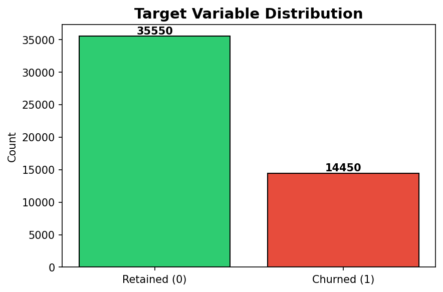
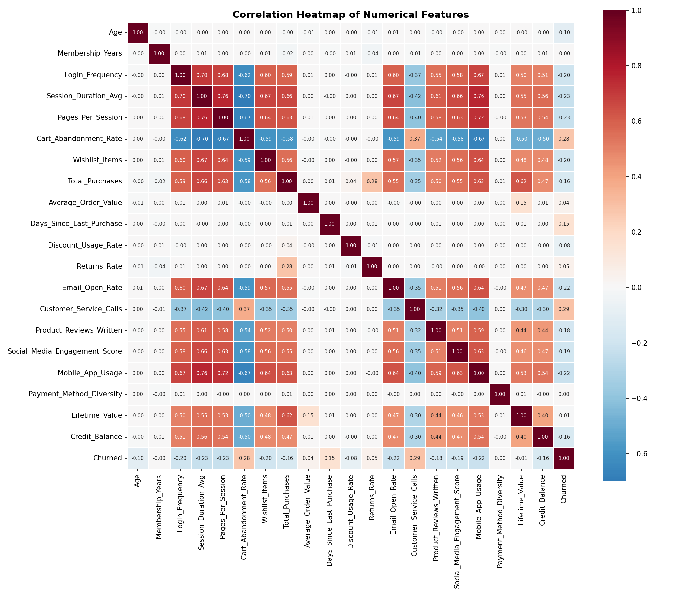
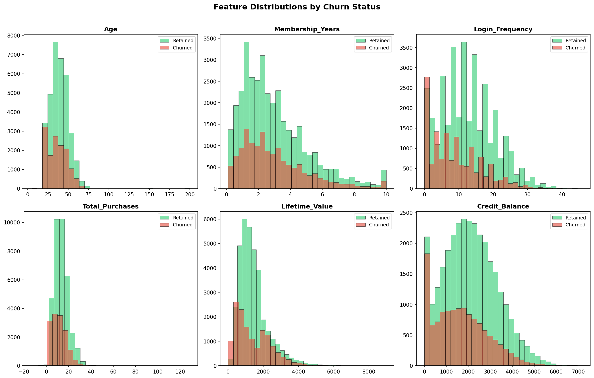
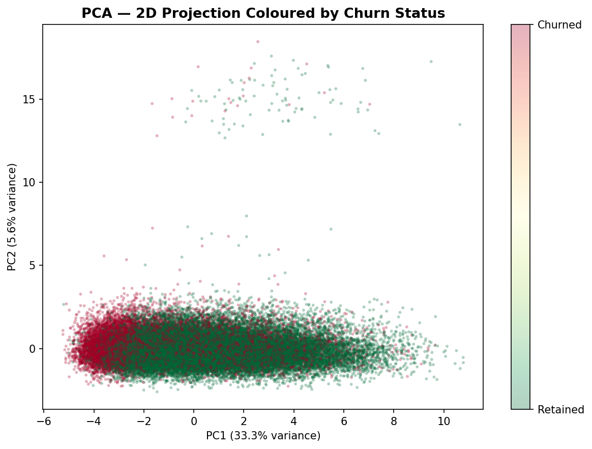
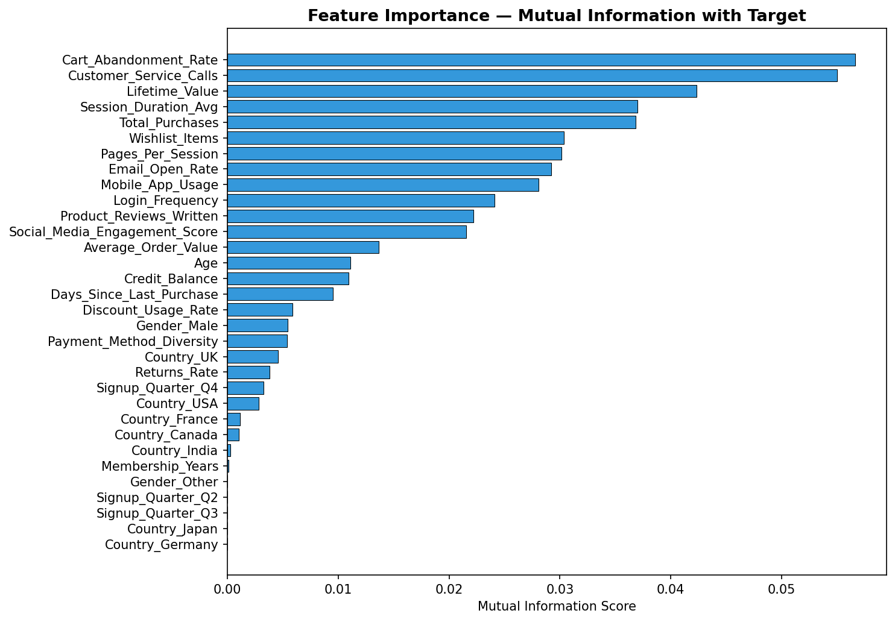
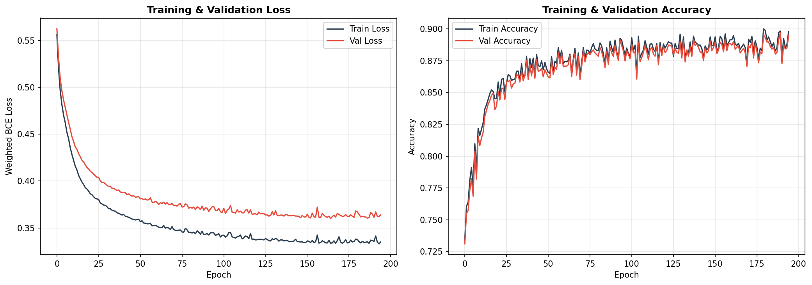
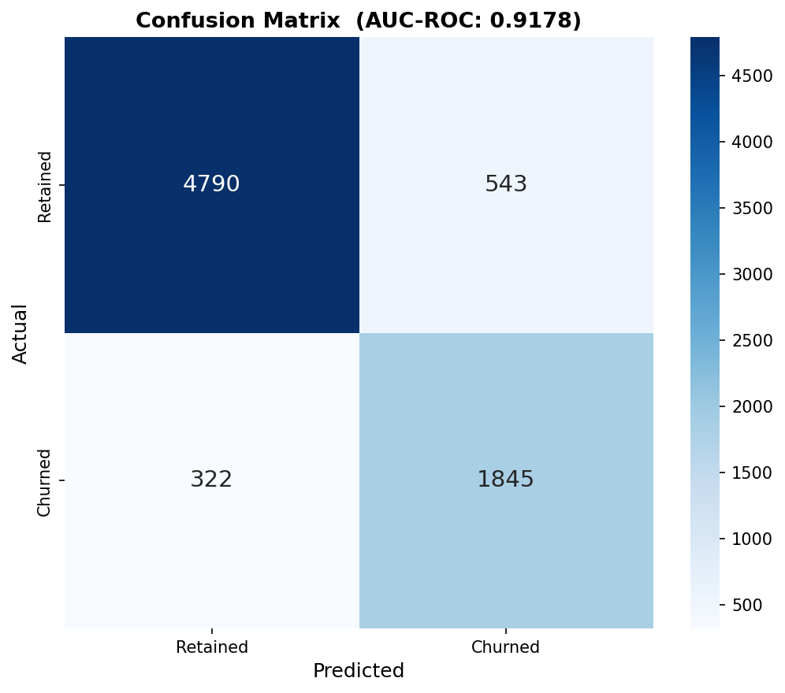
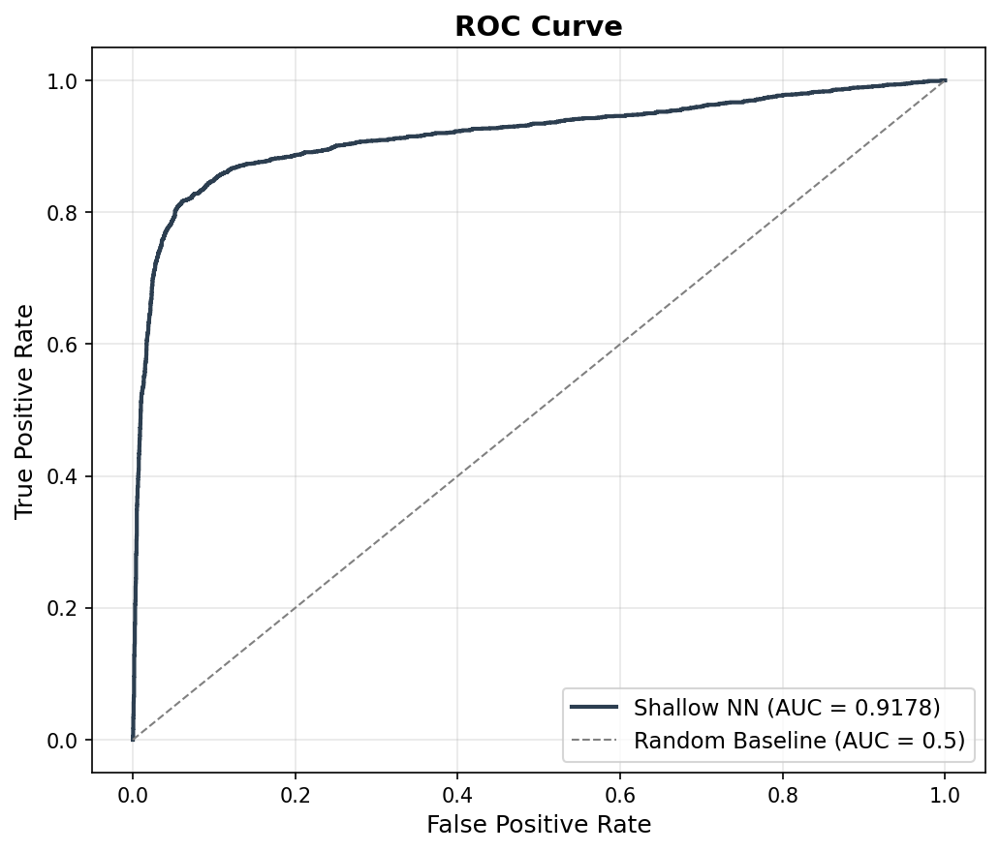
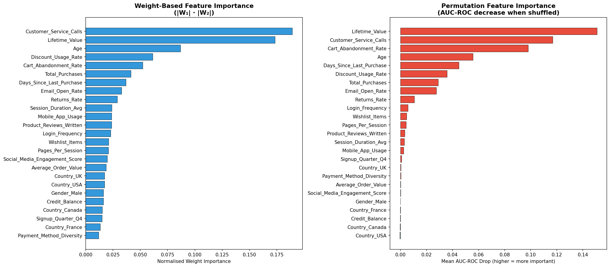

# Problem Definition & Dataset {background-color="#F8FAFC"}

## Project Objective

::: {.columns}
::: {.column width="60%"}
### The Business Mission
Develop an automated system to predict and prevent customer churn for an e-commerce subscription service.

### Dataset Overview
- **Volume:** 50,000 customers
- **Features:** 25 Behavioral & Demographic
- **Churn Rate:** 28.9% (Imbalanced Class)
:::

::: {.column width="40%"}
### Core Challenges
1.  **Complexity**
    *   Non-linear relations
2.  **Imbalance**
    *   Favouring majority class
3.  **Noisy Data**
    *   High dimensionality
:::
:::

# Exploratory Data Analysis {background-color="#F8FAFC"}

## Target Distribution

::: {.columns}
::: {.column width="50%"}
{height="400px"}
:::

::: {.column width="50%"}
### Observations
- **Churned:** 14,450
- **Retained:** 35,550

### Implication
A standard accuracy metric would be misleading. We prioritize **AUC-ROC** and **Weighted Loss** to ensure we capture the minority churn class.
:::
:::

## Correlation Insights

::: {.columns}
::: {.column width="55%"}
{height="450px"}
:::

::: {.column width="45%"}
### Primary Drivers
- `Days_Since_Last_Purchase` (+)
- `Cart_Abandonment_Rate` (+)

### Protective Factors
- `Lifetime_Value` (-)
- `Membership_Years` (-)
:::
:::

## Behavior & PCA

::: {.columns}
::: {.column width="50%"}
{height="350px"}
:::

::: {.column width="50%"}
{height="350px"}
:::
:::

**Insight:** Overlapping distributions in PCA space justify the use of a **Neural Network** with non-linear activation to find complex boundaries.

# Methodology & Engineering {background-color="#F8FAFC"}

## Feature Selection Pipeline

::: {.columns}
::: {.column width="50%"}
### Preprocessing
1.  **Outlier Handling:** Winsorization
2.  **Imputation:** Mode/Median
3.  **Scaling:** StandardScaler
:::

::: {.column width="50%"}

**MI Selection:** Filtered 32 down to **25 high-influence features**.
:::
:::

## Architecture: Custom NumPy SNN

### Network Parameters
- **Input:** 25 Features
- **Hidden Layer:** 32 Units with **ReLU**
- **Output:** 1 Unit with **Sigmoid**

### Implementation Detail
Built from scratch using **NumPy** for raw matrix control. Includes:
- Manual Gradient Tracking via Chain Rule.
- **Weighted BCE Loss** to handle class imbalance.
- **He Initialization** for stable ReLU activation.

## Architecture: Design Decisions

| Component | Choice | Rationale |
|-----------|--------|-----------|
| Hidden Units | 32 | Optimal capacity balance |
| Activation | ReLU | Prevents vanishing gradients |
| Loss | Weighted BCE | Handles 28% churn rate |
| Regularization| L2 ($\lambda$=0.001) | Penalizes complex weights |
| Early Stopping| Patience=30 | Stops at epoch ~195 |

# Training & Results {background-color="#F8FAFC"}

## Optimization Strategy

### Hyperparameter Search
Tested LR (0.01-0.05) and L2 Lambda across 27 configurations.

### Best Configuration
- **Learning Rate:** 0.05
- **L2 Lambda:** 0.001
- **Validation F1:** 0.81
- **Validation AUC:** 0.91

## Training Stability

::: {.columns}
::: {.column width="60%"}

:::

::: {.column width="40%"}
### Convergence
- **Epochs:** 500 (Stopping at 195)
- **Validation Loss:** 0.3599
- Minimal gap between Train/Val suggests robust generalization without overfitting.
:::
:::

# Final Performance {background-color="#F8FAFC"}

## Evaluation Metrics

::: {.columns}
::: {.column width="50%"}
{height="380px"}
:::

::: {.column width="50%"}
{height="380px"}
:::
:::

| Metric | Score | 
|:---:|:---:|
| **AUC-ROC** | **0.91** |
| Precision | 0.81 |
| Recall | 0.81 |

# Business Impact {background-color="#F8FAFC"}

## Feature Importance (The Why)

::: {.columns}
::: {.column width="60%"}
{height="400px"}
:::

::: {.column width="40%"}
### Critical Churn Indicators
1.  **Service Friction:** High number of support calls.
2.  **Engagement Drop:** High Cart Abandonment.
3.  **Inactivity:** Days since last purchase.
:::
:::

## Retention Action Plan

### Retention Strategy
We recommend targeted intervention for customers with >3 service calls.

- **Priority Outreach:** Flag high-friction service callers.
-   **Win-Back Flows:** Auto-trigger for customers past their purchase window.
-   **Loyalty Incentives:** Focus on customers in their first 2 years of membership.

# Conclusion {background-color="#F8FAFC"}

## Summary
-   Custom NumPy Neural Network
-   High AUC-ROC (0.91)
-   Balanced Precision/Recall
-   Explainable insights for Business Strategy

## Q&A
### Thank You!